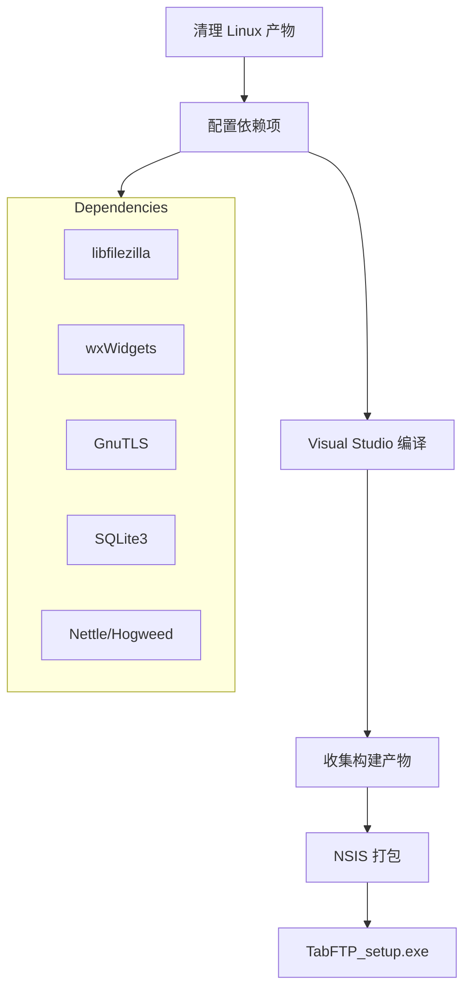

# Design Document: Windows Build for TabFTP

## Overview

本设计文档描述了将 TabFTP 从 Linux 构建环境迁移到 Windows 平台的技术方案。主要包括清理 Linux 编译产物、配置 Windows 依赖项、使用 Visual Studio 编译项目，以及使用 NSIS 创建安装包。

## Architecture



## Components and Interfaces

### 1. 清理脚本 (clean-linux-artifacts.ps1)

PowerShell 脚本，用于清理所有 Linux 相关的编译产物。

```powershell
# 伪代码
function Clean-LinuxArtifacts {
    # 删除对象文件
    Remove-Item -Recurse "*.o", "*.lo", "*.la", "*.gch"
    
    # 删除依赖目录
    Remove-Item -Recurse ".deps", ".libs"
    
    # 删除 AppImage 相关
    Remove-Item -Recurse "*.AppImage", "AppDir", "squashfs-root"
    
    # 删除 Linux 可执行文件
    Remove-LinuxExecutables "src/interface"
}
```

### 2. 依赖配置 (Dependencies.props)

MSBuild 属性文件，定义所有依赖库的路径。

```xml
<!-- 结构 -->
<PropertyGroup>
    <libfilezilla_include>路径</libfilezilla_include>
    <libfilezilla_lib>路径</libfilezilla_lib>
    <wxwidgets_include>路径</wxwidgets_include>
    <wxwidgets_lib>路径</wxwidgets_lib>
    <gnutls_include>路径</gnutls_include>
    <gnutls_lib>路径</gnutls_lib>
    <sqlite3_include>路径</sqlite3_include>
    <sqlite3_lib>路径</sqlite3_lib>
</PropertyGroup>
```

### 3. Visual Studio 解决方案结构

```
FileZilla.sln
├── engine.vcxproj      (静态库)
├── commonui.vcxproj    (静态库)
├── pugixml.vcxproj     (静态库)
└── interface.vcxproj   (可执行文件)
```

### 4. NSIS 安装脚本 (install.nsi)

基于现有的 `data/install.nsi.in` 模板，配置安装包内容。

## Data Models

### 清理目标文件类型

| 文件类型 | 扩展名/模式 | 描述 |
|---------|------------|------|
| 对象文件 | *.o | GCC 编译的对象文件 |
| Libtool 对象 | *.lo | Libtool 生成的对象文件 |
| Libtool 归档 | *.la | Libtool 生成的库归档 |
| 预编译头 | *.gch | GCC 预编译头文件 |
| 依赖目录 | .deps/ | Automake 依赖跟踪目录 |
| 库目录 | .libs/ | Libtool 库输出目录 |
| AppImage | *.AppImage | Linux AppImage 包 |
| AppDir | AppDir/, squashfs-root/ | AppImage 构建目录 |

### 依赖库版本要求

| 依赖库 | 最低版本 | 用途 |
|-------|---------|------|
| libfilezilla | 0.51.1 | 核心库 |
| wxWidgets | 3.2.1 | GUI 框架 |
| GnuTLS | 3.6.0 | TLS/SSL |
| SQLite3 | 3.7.0 | 数据库 |
| Nettle | 3.1 | 加密 |
| Hogweed | 3.1 | 加密 |

### 安装包内容结构

```
TabFTP/
├── FileZilla.exe          (主程序，重命名为 TabFTP.exe)
├── fzsftp.exe             (SFTP 支持)
├── fzputtygen.exe         (密钥生成)
├── *.dll                  (运行时依赖)
├── resources/
│   ├── defaultfilters.xml
│   ├── finished.wav
│   ├── 16x16/
│   ├── 20x20/
│   ├── 24x24/
│   ├── 32x32/
│   ├── 48x48/
│   ├── 480x480/
│   └── default/           (默认主题)
├── locales/
│   └── *.mo               (语言文件)
└── docs/
    └── fzdefaults.xml.example
```

## Correctness Properties

*A property is a characteristic or behavior that should hold true across all valid executions of a system-essentially, a formal statement about what the system should do. Properties serve as the bridge between human-readable specifications and machine-verifiable correctness guarantees.*

### Property 1: Linux 产物完全清理

*For any* source directory containing Linux build artifacts (.o, .lo, .la, .gch files, .deps, .libs directories), after executing the cleanup script, the directory should contain zero Linux artifacts while preserving all source files (.cpp, .h, .mm) and project files (.sln, .vcxproj).

**Validates: Requirements 1.1, 1.2, 1.3, 1.4, 1.5, 1.6, 1.7, 1.8, 1.9, 1.10**

### Property 2: 依赖配置完整性

*For any* valid Dependencies.props file, it should contain valid paths for all required libraries (libfilezilla, wxWidgets, GnuTLS, SQLite3) and all specified paths should exist on the file system.

**Validates: Requirements 2.6, 2.7, 2.8**

### Property 3: 构建输出完整性

*For any* successful Release build, the output directory should contain FileZilla.exe, fzsftp.exe, fzputtygen.exe, and all required DLL dependencies.

**Validates: Requirements 3.5, 4.1, 4.2, 4.3, 4.4**

## Error Handling

### 清理脚本错误处理

1. **文件锁定**: 如果文件被其他进程锁定，记录警告并继续
2. **权限不足**: 如果没有删除权限，显示错误并退出
3. **路径不存在**: 如果指定路径不存在，跳过并继续

### 构建错误处理

1. **依赖缺失**: 检查 Dependencies.props 是否存在，如果不存在则显示配置说明
2. **编译错误**: 显示详细的编译错误信息
3. **链接错误**: 检查库路径配置是否正确

### NSIS 打包错误处理

1. **文件缺失**: 如果必需文件不存在，显示错误并退出
2. **NSIS 未安装**: 检查 makensis 是否在 PATH 中

## Testing Strategy

### 单元测试

由于这是一个构建配置项目，主要通过脚本验证来测试：

1. **清理脚本测试**: 创建测试目录结构，运行清理脚本，验证结果
2. **依赖配置测试**: 验证 Dependencies.props 文件格式正确
3. **构建测试**: 执行完整构建，验证输出文件存在

### 集成测试

1. **完整构建流程测试**: 从清理到生成安装包的完整流程
2. **安装包测试**: 在干净的 Windows 系统上测试安装包

### 属性测试

由于这是构建配置项目，属性测试主要通过脚本验证实现：

- 使用 PowerShell 脚本验证清理结果
- 使用文件系统检查验证构建输出

**测试框架**: PowerShell Pester (用于脚本测试)

**最小迭代次数**: 由于是确定性操作，每个测试运行 1 次即可
