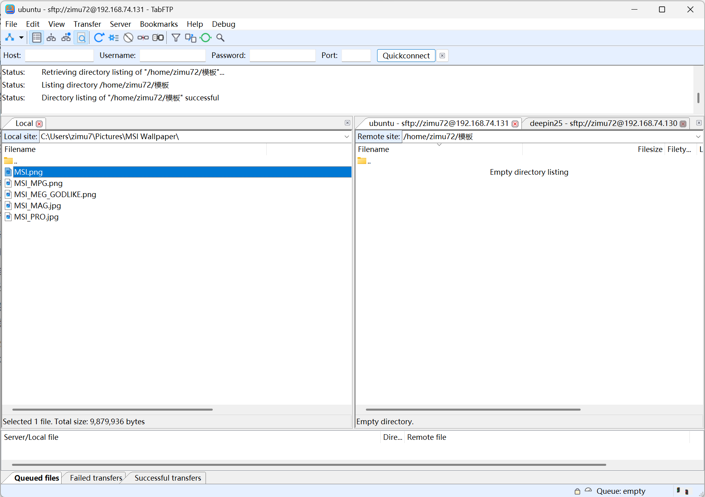

# TabFTP

基于著名开源软件FileZilla Client

### 简介

TabFTP 客户端是一个快速、可靠的跨平台 FTP、FTPS 和 SFTP 客户端，拥有丰富的功能和直观的图形用户界面。它是基于著名的 FileZilla Client 开发的开源项目，继承了 FileZilla 的所有强大功能，同时在 FileZilla 基础上对多标签页架构进行了深度改造，专为高效多站点运维场景设计。

### 功能特性

1. **一对多标签架构**  
   左侧全局共享本地文件浏览器（所有标签统一工作区），右侧独立标签页管理各远程服务器；切换标签仅更新远程视图，本地操作始终聚焦，大幅提升多站点操作效率。

2. **强制单实例运行**  
   启动时自动检测实例，新连接请求（命令行/站点文件/快捷方式）通过 IPC 传递至主窗口，在新标签页中打开连接，杜绝多窗口冗余。

3. **智能标签页管理**  
   支持标签拖拽排序、快捷键操作（Ctrl+T/W/Tab）、右键菜单（重连/复制连接/在新标签打开）、状态图标标识；关闭程序时自动保存所有标签会话，启动可选恢复。

4. **批量上传至全部远程站点**  
   本地文件右键菜单新增“上传到所有远程站点”（仅当 ≥1 远程站点连接时可见），自动遍历所有已连接标签，串行/并行上传至各站点当前目录，实时进度反馈 + 失败容错 + 成功/失败统计汇总。

5. **传输任务全局统筹**  
   统一传输队列清晰标注任务来源标签，支持跨标签任务监控、暂停/恢复/取消；上传下载逻辑精准绑定当前激活远程标签，操作逻辑清晰无歧义。

6. **状态精准隔离与共享**  
   本地路径/选中状态/面板比例全局共享；各远程标签独立维护连接信息、目录路径、浏览历史，互不干扰，兼顾操作连贯性与会话独立性。

7. **远程至远程传输功能**  
   首个远程标签页自动映射至左侧本地面板，用户可直接将文件从一个远程服务器拖拽至另一远程标签页，系统通过本地临时缓存智能中转，无需手动下载再上传，高效完成跨服务器文件迁移。

8. **100% 原生功能保留**  
   完整继承 FileZilla 所有核心能力：站点管理器、书签、同步浏览、FTP/FTPS/SFTP 协议、传输队列、日志窗口等，零功能损耗，用户可平滑迁移，无学习成本。

> 📌 提示：FileZilla 原有功能的完整说明文档请参阅项目中的 `readme_filezilla` 文件。

